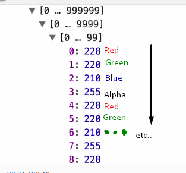

# JavaScript-30-day-challenge
I am following this fun challenge by [Wes Bos](https://javascript30.com).

# Handy notes for each day.

## Day 1

## Day 2

## Day 3 - CSS Variables

* `:root` is the document's root element, the `<html></html>`, and is where we define CSS variables.

* A CSS variable is defined as: `--<varName>: <value><unit>`

* We can set a CSS variable **from JavaScript** using: `document.documentElement.style.setProperty('--<variableName>', '<value>')`

* **Improvement:** We can use the HTML `onInput` attribute for detecting changes on the `<input>` element. For example when moving the 'range' bar or changing  the 'color' when it's color type.

* The `filter` CSS property applied to an image is very cool, we used it together with the `blur` function.

## Day 4 - Array Cardio Day 1

* Just exercises on array prototype methods: `filter`, `map`, `sort`, 

* We also remember the fact we can't use these methods after using a `document.querySelector` or document.querySelectAll, because they return a NodeList. We convert it using Array.from(NodeList) or using the ES6 spread as: [...NodeList]

* Mind blow when seeing `console.table()`  💥 💥 💥

* JavaScript Array `reduce` method is also very cool and I like the syntax a lot. `array.reduce( function(obj,next), <initial value>)`;

## Day 5 - Flex Panel Gallery

* Wes Bos has another series with only flexbox exercises and that's gonna be my next entertainment after I end this one.

* Remember: (I already knew this but just for the record) We apply the `display: flex;` attribute in the container of our template in order to use flexbox. This will make the child elements to display inline with a width as big as their content. Later, we tell each child which fraction of the remaining space they should take.

* Justify content: aligns a flexible container in the X-Axis, align-items: same but in the Y-Axis, also in a flexible container.

* `>` Selects immediate children. These are called CSS **Combinators** || Asterisk selector: selects all elements.

## Day 6 - Type Ahead

* `fetch` function itself returns a promise. When using `then` it returns a **blob** of data.

* The blob has to be converted from the raw data into JSON, we use for that the `blob.json()` **async** method.

* Again, we use the ES6 spread operator to spread or expand an array into multiple arguments to the push method.

* Using .join() to convert an array of `<li>` elements into an HTML string. The argument of the `join` function is the string character we may want to add in between the HTML elements.

## Day 7 - Array Cardio Day 2

* Playing with `some` and `every`. Very simple this day.

* Be careful with date prototype getYear function and use **getFullYear** instead.

* You can see the name and value of a boolean in the console by writing it as console.log({variableName})

* `splice(index, n, a1, a2...)` method removes n elements starting at index and adds an elements.

* `slice(start, endNotIncluded)` returns  from start to end, end not included.

## Day 8 - Fun with HTML5 Canvas

* To start drawing on a canvas, first get the context. It could be 2D or 3D.

## Day 9 - 14 Must Know Dev Tool Tricks

1. When an element style is changing and we don't know what's doing it, we can inspect Break on... attribute modifications => And the debugger will stop exactly where the element change is happening.
2. **%s:** console.log accepts raditional string interpolation console.log( My string is %s, 'cool'), vs ES6
3. **%c:** It also accepts styling as console.log( %c Some text, 'font-size:50px;')
4. console.warn()
5. console.error()
6. console.info()
7. console.assert: Allows checking if something is true => When it is **not true** the console.log will shout.
8. console.clear() will clear the console.
9. We can **view DOM elements** with `console.dir(element)`
10. We can **group console messages** by inserting the logs in between the methods console.groupCollapsed(<groupName>) and console.groupEnd(<groupName>)
11. console.count(argument) Returns how many times that `console.count(argument)` line has been executed.
12. console.timeEnd(argument) will return how much time has passed since console.time(argument) was executed.
13. console.table() We already know about it.
14. console.log *This was number 1 but I skipped*.

## Day 10 - Hold Shift and Check Checkboxes

* Challenging task.
* I learnt that click events have the shiftKey property.
* Inside the event handler, 'this' refers to the html element that was clicked. Even inside a forEach loop inside that event handler.

## Day 11 - Custom HTML5 Video Player

* It was surprising that calling to the method that toggles the icon content from the method 'togglePlay' does not work.
  You have to listen to 'play' and 'pause' events to do so.
* Refresher on how to use data attribute:
  1)Declare in the element as data-<data name>
  2)Access it from the element JS scope as element.dataset.<data name>
* To know where something was clicked in coordinates ->

## Day 12 -

## Day 13 -

## Day 14 -

* Debounce function

## Day 15 - LocalStorage and Event delegation
* Forms trigger a `submit` events we can subscribe to when user clicks an element of type 'submit'
* Conditional templating is amazinlgy possible with ES6 string templates.
* This one was a lot of fun.

## Day 16 - Mouse move shadow
* ES6 way to initialize variables width and height `const {offsetWidth: width, offsetHeight: height} = hero `
* For the mouse events, if we listen over a parent, in the callback function the **this** object will always be the parent but the **event.target** changes depending on which child element the mouse is over.
* event.offsetY and event.offsetX give the coordinates of the mouse.

## Day 17 - Sorting bands name without articles
* Reminder of sort, trim and replace.
* JavaScript regex pattern should contain the '/' separator.
* Refresh regexps.

## Day 18
* The function `split(char)` returns an array containing the chunks obtained after splitting over the char parameters.
* Refresher on the `reduce` function. collection.reduce((item,initialValue)=>return initialValue+item,initialValue);

## Day 19 - Unreal Webcam Fun
* To access user video **navigator.mediaDevices.getUserMedia({video: true, audio: false})**
* This returns a promise of type **MediaStream**.
* In order to render it in video.src we need it to be transformed into a URL. **window.URL.createObjectURL(mediaStream)**
* blob: Binary Large OBject
* We can draw the video in the canvas as it were an image.
* Events triggered by a <video> element can be reviewed [here](https://www.w3schools.com/tags/av_event_canplay.asp)
* We get the image data (pixels) using ctx.getImageData  

## Day 20 - Speech recognition
* We can access HTML5 speech recognition without the need of any external library. It is available in a **global variable** that lives in the browser, on top of `window`. 
* At the moment, it is only available in Chrome under window.webkitSpeechRecognition.
* interimResults: If set to true, the results that are not yet final will be returned.

## Day 21 - Geolocation based speedometer and compass
* We can get user coordinates using navigator.geolocation.watchPosition.
* This method success callback will return data with a variable frequency. This frequency depends on how
fast the device is moving.
* 